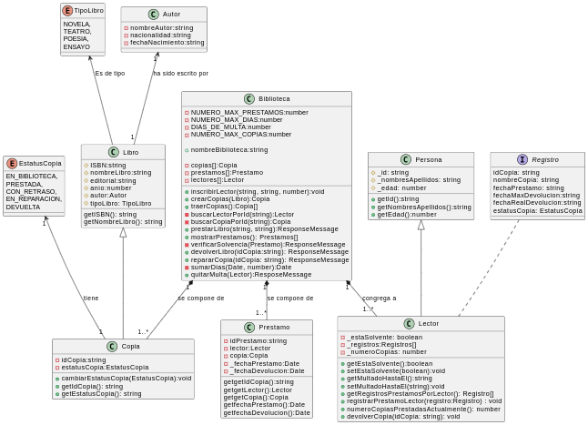

# Ejercicio 005. La Biblioteca

> ### Requerimiento

Una biblioteca tiene copia de libros. Estos últimos se caracterizan por su nombre, tipo (novela, teatro, poesía, ensayo), editorial, año y autor.

Los autores se caracterizan por su nombre, nacionalidad y fecha de nacimiento.

Cada copia tiene un identificador, y puede estar en la biblioteca, prestada, con retraso o en reparacion. 

Los les lectores pueden tener un máximo de tres libros en préstamo.

Cada libro se presta un máximo de 30 días, por cada día de retraso, se impone una multa de dos dias sin posibilidad de coger un nuevo libro.

- Realizar un diagrama de clases y añade los métodos necesarios para realizar el prestamo y devolución de libros.

> ### Diagrama UML

