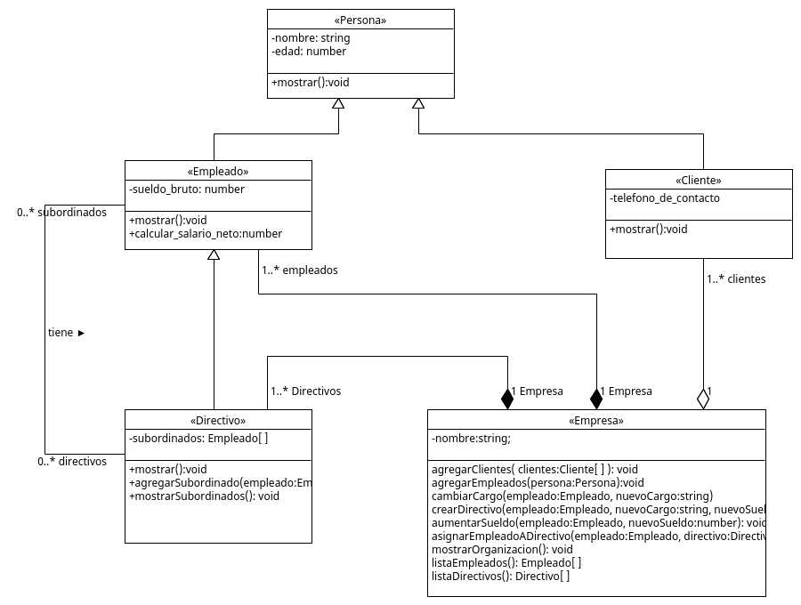

## Ejercicio 001. La Empresa

> Requerimiento
1. Una aplicacion necesita almacena informacion sobre empresas, sus empleados y sus empreados
2. Ambos se caracterizan por su nombres y edad
3. Los empleados tienen un sueldo bruto, los empleados que son directivos tienen una categoria, asi como un conjunto de empledos subordinados.
4. De los clientes ademas se necesita conocer su telefono de contacto
5. La aplicacion necesita mostrar los datos de empleados y clientes.

> Diagarama UML

