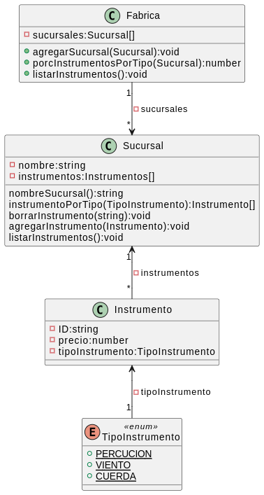

# Ejercicio 003. La Fábrica

> Requerimiento

Una fábrica de instrumentos musicales posee una lista con todas sus sucursales. Cada sucursal tiene su nombre y una lista con todos los instrumentos a la venta. De cada uno de ellos se sabe su ID
alfanumérico, su precio y su tipo (Percusión, Viento o Cuerda).

> Puntos a desarrollar:

1. Desarrollar el diagrama de clases UML que modele lo enunciado y donde consten las clases con
sus atributos, métodos y relaciones (los constructores pueden omitirse).
1. Crear un proyecto en Java que resuelva:
    - La explotación del método listarInstrumentos que muestre en la consola todos los datos de cada uno de los instrumentos.
    - La explotación del método instrumentosPorTipo que devuelva una lista de instrumentos cuyo tipo coincida con el recibido por parámetro.
    - La explotación del método borrarInstrumento que reciba un ID y elimine el instrumento asociado a tal ID de la sucursal donde se encuentre.
    - La explotación del método porcInstrumentosPorTipo que reciba el nombre de una sucursal y retorne los porcentajes de instrumentos por tipo que hay para tal sucursal.

Tomado del video [Charly Cimino](https://www.youtube.com/watch?v=orUY4wpf7q4)
> Diagrama UML

