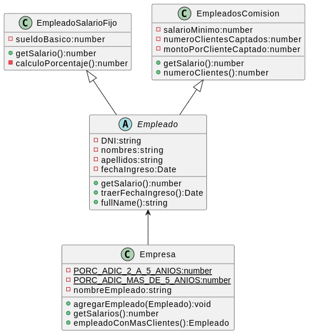

# Ejercicio 004. La Empresa

> ### Requerimiento

Cierta empresa requiere una aplicación informática para administrar los datos de su personal, del cual se conoce: número de DNI, nombre, apellido y año de ingreso. Existen dos categorías de empleados: con salario fijo y a comisión.

Los empleados a comisión tienen un salario mínimo, un número de clientes captados y un monto a cobrar por cada cliente captado. El salario se obtiene multiplicando los clientes captados por el
monto por cliente. Si el salario obtenido por los clientes captados no llega a cubrir el salario mínimo, cobrará el salario mínimo.

Los empleados con salario fijo tienen un sueldo básico y un porcentaje adicional en función del número de años que llevan la empresa:

 - Menos de 2 años: Nada
 - De 2 a 5 años: 5% más.
 - Más de 5 años: 10% más.

Basado en el enunciado descripto, realizá:

- A) El diagrama de clases que lo modelice, con sus relaciones, atributos y métodos.
- B) La implementación del método mostrarSalarios que imprima por consola el nombre completo de cada empleado junto a su salario.
- C) La implementación del método empleadoConMasClientes que devuelva al empleado con mayor cantidad de clientes captados (se supone único).

Tomado del video [Charly Cimino](https://www.youtube.com/watch?v=gHy4Ls7E49c)

> ### Diagrama UML

